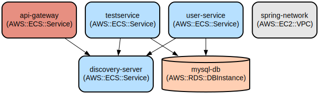

# Spring Cloud Microservices Architecture with API Gateway and Service Discovery

This project implements a scalable microservices architecture using Spring Cloud, featuring centralized routing through an API Gateway and service discovery via Eureka Server. The architecture enables dynamic service registration, load balancing, and unified API management.

The system consists of multiple microservices that work together to provide a robust and maintainable application infrastructure. It uses Spring Cloud Gateway for request routing, Netflix Eureka for service discovery, and Docker for containerization. The architecture supports easy scaling and deployment of services while maintaining loose coupling between components.

## Repository Structure
```
.
├── Api Gateway/                    # API Gateway service for centralized routing
│   └── Api-Gateway/               # Spring Cloud Gateway implementation
├── Discovery-Server/              # Eureka Server for service discovery
├── TestService/                   # Test microservice with basic endpoints
├── User-Service/                  # User management microservice
└── docker-compose.yml            # Docker composition for all services

Key integration points:
- API Gateway routes (/api/v1/user/**, /api/v1/test/**)
- Eureka Server (port 8761)
- MySQL Database connection
- Service-to-service communication via Feign Client
```

## Usage Instructions
### Prerequisites
- JDK 21 or later
- Docker and Docker Compose
- Maven 3.6.3 or later
- MySQL 8.0 or later

### Installation

1. Clone the repository:
```bash
git clone <repository-url>
cd <repository-name>
```

2. Build all services:
```bash
# Build Discovery Server
cd Discovery-Server
./mvnw clean package

# Build API Gateway
cd ../Api\ Gateway/Api-Gateway
./mvnw clean package

# Build Test Service
cd ../../TestService
./mvnw clean package

# Build User Service
cd ../User-Service
./mvnw clean package
```

3. Start the services using Docker Compose:
```bash
docker-compose up -d
```

### Quick Start
1. Verify services are running:
```bash
# Check Eureka Dashboard
open http://localhost:8761

# Verify API Gateway
curl http://localhost:8080/actuator/health
```

2. Test the User Service endpoint:
```bash
curl http://localhost:8080/api/v1/user/test
```

3. Test the Test Service endpoint:
```bash
curl http://localhost:8080/api/v1/test/hello
```

### More Detailed Examples
1. Create a new user:
```bash
curl -X POST http://localhost:8080/api/v1/user \
  -H "Content-Type: application/json" \
  -d '{"username":"testuser","email":"test@example.com"}'
```

### Troubleshooting
1. Service Registration Issues
- Problem: Services not appearing in Eureka
- Solution: 
  ```bash
  # Check Eureka client configuration
  cat */src/main/resources/application.properties
  # Verify eureka.client.service-url.defaultZone is correct
  ```

2. API Gateway Routing Issues
- Problem: 404 errors when accessing services
- Solution:
  ```bash
  # Check Gateway routes
  cat Api\ Gateway/Api-Gateway/src/main/resources/application.yml
  # Verify route configurations match service names
  ```

3. Database Connection Issues
- Problem: Services fail to start due to database connection
- Solution:
  ```bash
  # Verify MySQL is running
  docker ps | grep mysql
  # Check database credentials in application.properties
  ```

## Data Flow
The system implements a layered microservices architecture with centralized routing and service discovery.

```ascii
                    ┌─────────────────┐
                    │   API Gateway   │
                    │    (Port 8080)  │
                    └────────┬────────┘
                             │
                    ┌────────┴────────┐
                    │ Discovery Server│
                    │   (Port 8761)   │
                    └────────┬────────┘
                             │
         ┌───────────────────┴───────────────────┐
         │                                       │
┌────────┴────────┐                   ┌─────────┴─────────┐
│   User Service  │ ◄─── Feign ─────► │   Test Service    │
│   (Port 9000)   │                   │    (Port 9001)    │
└────────┬────────┘                   └─────────┬─────────┘
         │                                      │
         └──────────────► MySQL ◄──────────────┘
```

Component Interactions:
1. API Gateway routes incoming requests to appropriate services
2. Services register with Eureka Discovery Server
3. Services discover each other through Eureka
4. User Service communicates with Test Service via Feign Client
5. Both services persist data to MySQL database
6. Gateway provides load balancing across service instances
7. Services maintain heartbeat with Discovery Server

## Infrastructure


- Discovery Server:
  - Type: Eureka Server
  - Port: 8761
  - Purpose: Service registration and discovery

- API Gateway:
  - Type: Spring Cloud Gateway
  - Port: 8080
  - Routes:
    - /api/v1/user/** → USER-SERVICE
    - /api/v1/test/** → TestService

- Database:
  - Type: MySQL
  - Port: 3306
  - Databases: user, test

## Deployment
1. Prerequisites:
- Docker environment
- Network access for container communication

2. Deployment Steps:
```bash
# Build all services
./mvnw clean package -DskipTests

# Start infrastructure
docker-compose up -d

# Verify deployment
docker-compose ps
```

3. Environment Configuration:
- Set JAVA_HOME for Maven builds
- Configure database credentials in application.properties
- Adjust service ports in docker-compose.yml if needed

4. Monitoring:
- Access Eureka dashboard: http://localhost:8761
- Check service logs: `docker-compose logs -f [service-name]`